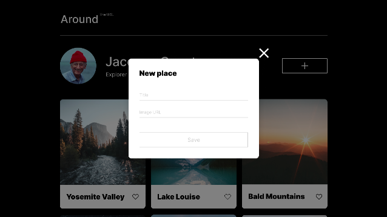
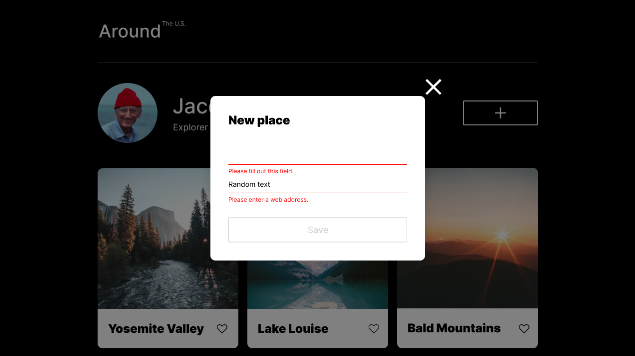
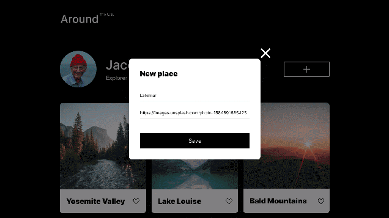

# Project 6: Around The U.S.

### Overview

- Intro
- Figma
- Images
- Javascript

**Intro**

In this project, validation ensures that when users submit forms, the data is correct and reliable. It's an important step for making sure everything works smoothly.

**Figma**

- [Link to the project on Figma](https://www.figma.com/file/N3zUeequnpvMX807FfYAZW/Sprint-6-Around-The-U.S.?type=design&node-id=0-3&mode=design&t=5Sgh8JhM81o038fX-0)

**Images**

## Project features

- Semantic HTML5
- Flat BEM file structure
- Like buttons
- CSS Grid Layout
- Flexbox
- Positioning
- Hidden overflows
- Javascript
- Modals
- Templates
- DOM
- Github deployment
- "Like" buttons
- Cloning templates
- "Delete" functionality
- Form validation

## Plan on improving the project

- Learn more Javascript to further improve website
- Option to change avatar

## Project deployment

https://lolomuffin.github.io/se_project_aroundtheus/
