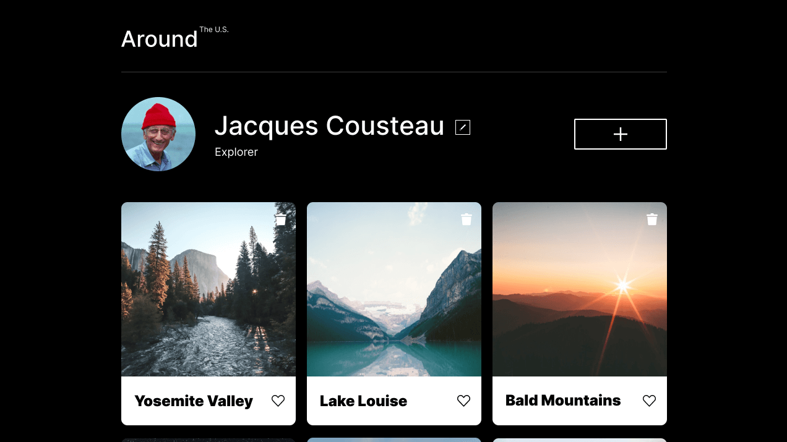
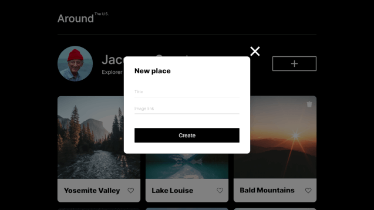
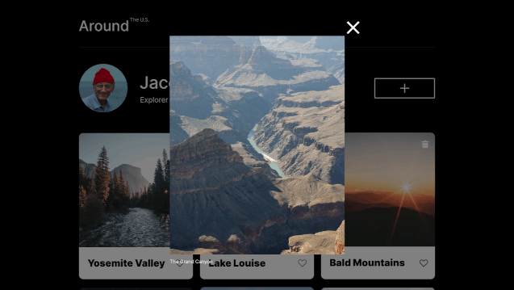
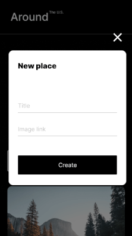
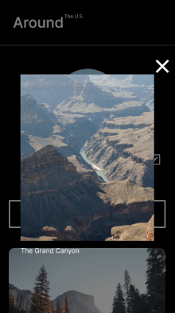

# Project 3: Around The U.S.

### Overview

- Intro
- Figma
- Images

**Intro**

This project is made so all the elements are displayed correctly on popular screen sizes. We recommend investing more time in completing this project, since it's more difficult than previous ones.

**Figma**

- [Link to the project on Figma](<https://www.figma.com/file/JFPhASqvZ5pBjQV2ouUlim/Sprint-5_-Around-The-U.S.-_-desktop-%2B-mobile-(Copy)?type=design&node-id=1%3A174&mode=design&t=ZdU1p4DzRiKwv23E-1>)

**Images**

## Project features

- Semantic HTML5
- Flat BEM file structure
- Like buttons
- CSS Grid Layout
- Flexbox
- Positioning
- Hidden overflows
- Javascript
- Modals
- Templates
- DOM
- Github deployment
- "Like" buttons
- Cloning templates
- "Delete" functionality

## Plan on improving the project

- Learn more Javascript to further improve website
- Option to change avatar

## Project deployment

https://lolomuffin.github.io/se_project_aroundtheus/
